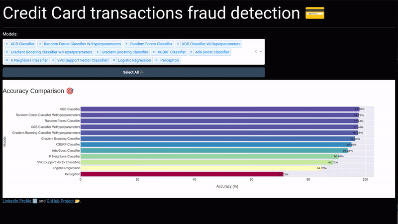

# Credit Card transactions fraud detection using Machine Learning and Dash!

<table>
<tr>
<td>
This project aims to perform an analysis of the credit card fraud transaction dataset using Machine Learning and Dash techniques.
  
Project Information:

 - Objective: Analyze the credit card fraud transaction dataset.
 - Tools Used: Python, various Machine Learning models, and Dash.

</td>
</tr>
</table>

## Useful Links
- Challenge: [Challenge Link](https://community.plotly.com/t/dash-app-challenge-fraud-detection/82409)
- Dataset: [Dataset Link on Kaggle](https://www.kaggle.com/datasets/kartik2112/fraud-detection?select=fraudTrain.csv)

###  Development Environment Setup

To set up the development environment, follow these steps:

- Install Python 3.10.6
- Clone this repository: `git clone <LINK>`
- Create and activate a virtual environment: `python3 -m venv env` and `source env/bin/activate`
- Install dependencies: `pip install -r requirements.txt`
- Run `main.py`, this will launch the Dash application.

# Proyecto de Detección de Fraude en Transacciones con Tarjetas de Crédito

<table>
<tr>
<td>
Este proyecto tiene como objetivo realizar un análisis del conjunto de datos de fraude en transacciones con tarjetas de crédito utilizando técnicas de Machine Learning y Dash.
  
 Información del Proyecto:
 - Objetivo: Analizar el dataset de fraude en transacciones con tarjetas de crédito.
 - Herramientas Utilizadas: Python, varios modelos de Machine Learning y Dash.

</td>
</tr>
</table>

## Enlaces Útiles
- Desafío: [Link al Desafío](https://community.plotly.com/t/dash-app-challenge-fraud-detection/82409)
- Dataset: [Link al Dataset en Kaggle](https://www.kaggle.com/datasets/kartik2112/fraud-detection?select=fraudTrain.csv)

###  Configuración del entorno de desarrollo

Para configurar el entorno de desarrollo, sigue los siguientes pasos:

- Instala Python 3.10.6
- Clona este repositorio: `git clone <LINK>`
- Crea y activa un entorno virtual: `python3 -m venv env` y `source env/bin/activate`
- Instala las dependencias: `pip install -r requirements.txt`
- Ejecuta `main.py`, esto lanzará el Dash.

